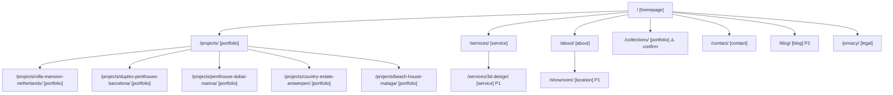

# SITEMAP-DRAFT.md
# By Shakir — Complete Page Inventory
# Date: 2026-04-07 (updated: English URL slugs)
# Status: DRAFT — awaiting client confirmation on /collections/, blog, location pages, showroom
# Archetype: B — Visual Portfolio (Interieurontwerper, highest visual refinement)
# URL convention: English slugs (universal for NL + international visitors), Dutch page content

---

## Page Inventory — Full Table

| New URL | Page Type | Priority | Old URL(s) | Status | Notes |
|---|---|---|---|---|---|
| `/` | homepage | P0 | `/` | keep-exact | Full rebuild |
| `/projects/` | portfolio | P0 | `/projects/` | keep-exact | Same slug — no redirect needed |
| `/projects/villa-mansion-netherlands/` | portfolio | P0 | `/project/rotterdamnetherlands/` | keep-redirect | Full case study with gallery |
| `/projects/duplex-penthouse-barcelona/` | portfolio | P0 | `/project/duplexpenthousebarcelona/` | keep-redirect | Full case study with gallery |
| `/projects/penthouse-dubai-marina/` | portfolio | P0 | `/project/dubaimarina/` | keep-redirect | Full case study with gallery |
| `/projects/country-estate-antwerpen/` | portfolio | P0 | `/project/antwerpenbelgiumbyshakir/` | keep-redirect | Full case study with gallery |
| `/projects/beach-house-malaga/` | portfolio | P0 | `/project/project-malaga-spain-3/` | keep-redirect | Full case study with gallery |
| `/services/` | service | P0 | `/completeluxuryinteriors/` + 2 clones | merge | 3 duplicate old URLs all merge here |
| `/about/` | about | P0 | `/about-us/` | keep-redirect | Slug cleanup only (not language change) |
| `/contact/` | contact | P0 | `/contact/` | keep-exact | Slug unchanged |
| `/privacy/` | legal | P0 | — | new | Required by Dutch AVG/GDPR law |
| `/services/3d-design/` | service | P1 | — | new | Dedicated page for 3D visualization service |
| `/cookie-statement/` | legal | P2 | — | new | Recommended for Cloudflare Pages + analytics |

---

## Pages Dropped from Old Site

| Old URL | Reason | Redirect Target |
|---|---|---|
| `/completeluxuryinteriors_clone/` | Duplicate content | `/services/` |
| `/completeluxuryinteriors_clone-2/` | Duplicate content | `/services/` |
| `/gallery-category/bedrooms/` | WordPress taxonomy, no equivalent | `/projects/` |
| `/gallery-category/living-rooms/` | WordPress taxonomy, no equivalent | `/projects/` |
| `/gallery-category/couches/` | WordPress taxonomy, no equivalent | `/collections/` |
| `/gallery-category/chairs/` | WordPress taxonomy, no equivalent | `/collections/` |
| `/gallery-category/tables/` | WordPress taxonomy, no equivalent | `/collections/` |
| `/gallery-category/cinema-walls/` | WordPress taxonomy, no equivalent | `/projects/` |
| `/gallery-category/closets/` | WordPress taxonomy, no equivalent | `/projects/` |
| `/gallery-category/accessories/` | WordPress taxonomy, no equivalent | `/collections/` |
| `/project-gallery/gallery1/` through `gallery9/` | Thin WordPress CPT pages | `/projects/` |
| `/project-gallery/luxury-living-room-1/` | Thin WordPress CPT page | `/projects/` |
| `/shop/` | WooCommerce — unused | `/` |
| `/cart/` | WooCommerce — unused | `/` |
| `/checkout/` | WooCommerce — unused | `/` |
| `/my-account/` | WooCommerce — unused | `/` |
| `/elementor-1867/` | Raw Elementor draft | `/` |

---

## Page Count Summary

| Priority | Count | Pages |
|---|---|---|
| **P0** | 11 | Homepage, 5 project pages, portfolio overview, services, about, contact, privacy |
| **P1** | 1 | 3D-design |
| **P2** | 1 | Cookie statement |
| **TOTAL** | **13** | |
| **Confirmed dropped** | — | /collections/ (→ /projects/), /blog/, /showroom/ (section in /about/) |

---

## Page Types Requiring Reference HTML

These page types each need a dedicated visual reference before build:

| Page Type | Template Scope | Notes |
|---|---|---|
| **Homepage** | Unique | Full-bleed video hero, philosophy block, portfolio grid, process, testimonials, contact CTA |
| **Portfolio overview** (`/projects/`) | Unique | Cinematic card grid/masonry, hover states, project count |
| **Portfolio detail** (`/projects/[slug]/`) | Repeatable template | Hero image, case study copy, full image gallery, project metadata, back-nav |
| **Service page** (`/services/`) | Unique | Single-page services with process visualization, 3D section link |
| **About** (`/about/`) | Unique | Founder portrait, narrative copy, philosophy, credentials |
| **Contact** (`/contact/`) | Unique | Qualification form, WhatsApp CTA, map embed, opening hours |
| **Collections** (`/collections/`) | TBD | Filterable grid if confirmed; otherwise drop |
| **Blog index** (`/blog/`) | P2 | Grid of articles; only if confirmed |
| **Blog article** (`/blog/[slug]/`) | P2 | Long-form with imagery |
| **Legal** (`/privacy/`) | Standard | No custom design needed; match brand typography only |

---

## Confirmed Decisions

1. **`/collections/`** — DROPPED. All old `/collections/` and `/gallery-category/` traffic 301 → `/projects/`.
2. **`/showroom/`** — No dedicated page. Showroom information lives as a section within `/about/`.
3. **`/blog/`** — Not building.
4. **Location pages** — Yes, will be built (e.g., `/projects/netherlands/`, `/projects/dubai/`, `/projects/spain/`, `/projects/morocco/`) but NOT linked from the homepage to preserve luxury character. Added as P2, SEO-only entry points.

---

## Sitemap Diagram

Rendered image: `byshakir-sitemap.png` (project root)

---

## Next Steps After Confirmation

- Prompt 3: Inventory project photography in `/clients/byshakir/src/assets/images/projects/`
- Prompt 4: Final archetype classification + creative direction
- Prompt 5: Copy architecture (Dutch content, per-page)
- Prompt 6: Design system (`/teach-impeccable`) — brand colors, fonts, tokens
- Prompt 7+: Reference HTML per page type (starting with homepage)
